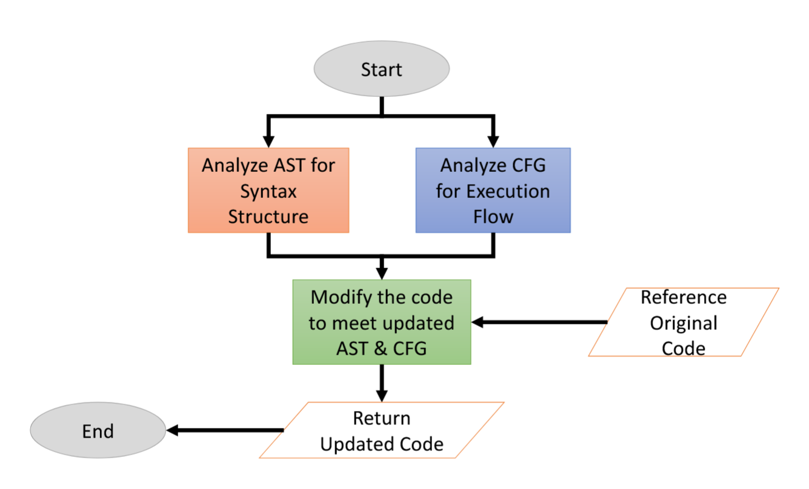

---
title: 'PaperRead: PromSec KDD2024'
date: 2024-11-18 13:35:56
tags: [Paper, AIAgent, MLInfra]
published: false
comments: false
---

```apa7
Mahmoud Nazzal, Issa Khalil, Abdallah Khreishah, and NhatHai Phan. 2024. PromSec: Prompt Optimization for Secure Generation of Functional Source Code with Large Language Models (LLMs). In Proceedings of the 2024 on ACM SIGSAC Conference on Computer and Communications Security (CCS '24). Association for Computing Machinery, New York, NY, USA, 2266–2280. https://doi.org/10.1145/3658644.3690298
```

## Abstract
\paragraph{} 提供了PromSec框架，通过优化提示（prompts）来增强大型语言模型生成安全和功能性源代码的能力。该方法结合静态和动态分析，并提出了一种新的评估标准。

## Introduction
\paragraph{} 介绍研究背景，包括大型语言模型生成代码的潜力和相关挑战，尤其是安全性和功能性问题。阐述研究动机与目标。

## Background

## How Secure are LLMs in Code Generation?
\paragraph{} 回顾与安全代码生成、提示优化和大型语言模型相关的研究，分析现有方法的局限性。

## PromSec Framework
### Code Fixes are One-to-Many

PromSec 的团队表示，代码生成的问题是一对多的，对于同样的一个需求，可以通过多种不同路径来实现。

### The Training and Operation Pipeline

$$
p^*=argmin_{p}[\alpha k(c)+\beta d(c,c_0)]
$$

- $p^*$ 是理想提示 optimal Prompt，$p$ 是每个循环输入提示。
- $c_0$ 是从用户输入的 Prompt 获得的原始生成代码，是 $p_0$ 在第一步生成的生成结果。
- $k(c)$ 是代码 $c$ 中的 CWE 计数，作为代码生成安全性的评估指标。
- $d(c, c_0)$ 表示 $c_0$ 和 $c$ 之间的功能差异性的指标。
- $\alpha$ 和 $\beta$ 是权重参数。


文章指出，这个 pipeline 存在一个挑战，prompt $p$ 与 $k(c)$ 和 $d(c, c_0)$ 是不可微的，无法使用常规的梯度优化方法。文章通过 GAN (Generative Adversarial Network，生成对抗网络) 来解决这个问题，他们将他们的 GAN 模型称为 gGAN。

gGAN 通过更改其图形表示来纠正代码问题，然后将其转化为及时调整。在这里，输入驱动生成器产生满足特定标准的输出，而判别器则评估这些输出是否符合定义的要求。由于它对图形数据进行操作，因此被归类为基于 GNN 的 GAN。在这种情况下，可以使用基于图卷积网络 （GCN） 的 GAN [36] 等架构。

> 中间描述了 gGAN 的超参数以及相关的损失配置等内容，在此略过。

对比损失函数的设计旨在鼓励生成具有更少 CWE 的图形，并且在原始图形和生成的图形之间的嵌入中具有更大的相似性，从而保持代码功能。The design of the contrastive loss function aims to encourage the generation of graphs with fewer CWEs and greater similarity in embeddings between the original and generated graphs, thereby maintaining code functionality.

**Discriminator Loss**

**Gradient Updates**

**Code-to-Graph Conversion**。在建议的管道中，可以使用现成的解析器包（如 [8， 49]）轻松地将代码转换为图形表示（例如 AST、CFG、DFG）。同样，将 AST 图转换为代码也是一项简单的任务，通过取消解析 AST 来实现。但是，将 CFG 转换为代码更为复杂。



### 4.2. Security Assessment
\paragraph{} 结合静态分析和动态分析工具评估生成代码的安全性，提出新的分析标准。

### 4.3. Functional Evaluation
\paragraph{} 采用功能性测试评估生成代码的有效性，并与安全评估结果结合。

## 5. Experiments
### 5.1. The Setup, Dataset, and Baselines
第一个是从 [46] 获得的 Python 代码库集，包括来自 MITRE [58] 文档、CodeQL 文档 [29] 的源代码以及 [46] 作者的手工代码。

```bib
Pearce, H., Tan, B., Ahmad, B., Karri, R., & Dolan-Gavitt, B. (2023). Examining zero-shot vulnerability repair with large language models. 2023 IEEE Symposium on Security and Privacy (SP), 2339–2356. https://doi.org/10.1109/SP46215.2023.10179324
```


我们向读者推荐附录 A.2 以了解有关此数据集的更多详细信息。第二个是从 [25， 71] 收集的 Java 提示数据集。对于安全性分析，我们选择了 Python 的 Bandit [18] 和 Java 的 SpotBugs [5]，因为它们在检测质量和时间复杂度方面具有广泛的普及性和出色的性能。但是，任何其他静态安全工具都可用于此目的。

### 5.2. Baselines
\paragraph{} 说明与PromSec比较的基线方法。

### 5.3. Metrics
\paragraph{} 定义评估指标，包括安全性评分、功能性评分，以及整体性能评价。

## 6. Results and Discussion
### 6.1. Comparison with Baselines
\paragraph{} 分析PromSec在安全性和功能性方面的表现，与基线方法进行对比。

### 6.2. Case Studies
\paragraph{} 展示具体案例，说明PromSec在解决特定安全问题时的优势。

### 6.3. Limitations
\paragraph{} 讨论PromSec方法的局限性及潜在改进方向。

## 7. Conclusion and Future Work
\paragraph{} 总结研究贡献，并展望未来可能的研究方向。

## References


## Reflection

- PromSec 通过 GAN 进行代码重构与优化。但是 CWE 的个数只被当作一个指标。是否存在可能使得 CWE 也能作为帮助优化的指向性内容？
