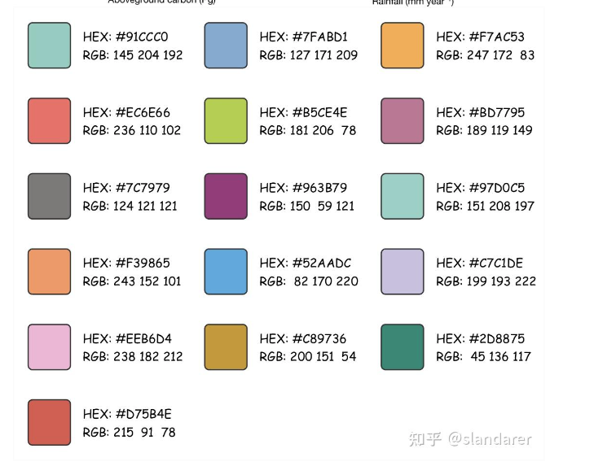

## Main Content

从二级标题开始，不使用一级标题以防止 MkDocs 的编译错误，导致标题标签无法正常编译。按照部分 Markdown 编译软件的要求来说，一篇文档只能有一个一级标题，但是由于笔者使用了 metadata 功能导致部分 Markdown 编译器无法识别到处于 metadata 之后的一级标题。因此，直接通过 metadata 的 title 字段来指定一级标题。

## Latex 子图

> https://zhuanlan.zhihu.com/p/536520607

使用 `subfig` 包来进行 Latex 子图的排版，需要使用的宏包如下，

```tex
\usepackage{float}      % 图片浮动位置
\usepackage{subfig}     % 子图包，不要与{subfigure}混用，{subfig}较新
\usepackage{overpic}    % 图片排版相关
```

```tex
\begin{figure}[ht]
	\centering
    % \captionsetup{labelformat=empty} % use to remove ref number. 
	\subfloat[Title1]{
        \includegraphics[width=.45\columnwidth]{1.png}
    }
	\subfloat[Title2]{
        \includegraphics[width=.45\columnwidth]{2.png}
    }
	\caption{Captions of figures.}
    \label{fig:}
\end{figure}
```

## Table Cell Color

在 LaTeX 中，要为表格中的单元格设置背景颜色，需要使用 **`xcolor`** 宏包。这个宏包允许我们定义颜色并应用于表格的单元格。下面是使用红色、黄色和橙色背景色的示例。

首先，在导言区引入 `xcolor` 宏包：

```latex
\usepackage[table]{xcolor}
```

然后，在表格中可以使用 `\cellcolor{colorname}` 来设置单元格的背景颜色。`colorname` 可以是 LaTeX 预定义的颜色（如 `red`、`yellow` 等），或者你可以自定义颜色。

这里是一个示例：

```latex
\begin{table}[h!]
\centering
\begin{tabular}{|c|c|c|}
\hline
\cellcolor{red} Red Cell & \cellcolor{yellow} Yellow Cell & \cellcolor{orange} Orange Cell \\
\hline
Data 1 & Data 2 & Data 3 \\
\hline
\end{tabular}
\end{table}
```

### 自定义颜色
如果你需要特定的红色、黄色或橙色，可以在导言区定义自定义颜色。例如：

```latex
\usepackage[table]{xcolor}

\definecolor{myred}{RGB}{255, 0, 0}      % 自定义红色
\definecolor{myyellow}{RGB}{255, 255, 0} % 自定义黄色
\definecolor{myorange}{RGB}{255, 165, 0} % 自定义橙色
```

然后在表格中应用这些自定义颜色：

```latex
\begin{table}[h!]
\centering
\begin{tabular}{|c|c|c|}
\hline
\cellcolor{myred} Custom Red & \cellcolor{myyellow} Custom Yellow & \cellcolor{myorange} Custom Orange \\
\hline
Data 1 & Data 2 & Data 3 \\
\hline
\end{tabular}
\end{table}
``` 

这样就可以在表格中使用红色、黄色和橙色的单元格背景色了。




`\toprule`、`\midrule` 和 `\bottomrule` 这三个指令属于 **`booktabs`** 宏包。该宏包用于创建更美观的表格线样式，特别适合排版质量要求较高的表格。

在使用 `booktabs` 宏包后，可以用这些指令来创建更清晰的表格分隔线，例如：

- `\toprule` 用于表格顶部的粗线。
- `\midrule` 用于表格内容之间的分隔线。
- `\bottomrule` 用于表格底部的粗线。

要使用这些命令，可以在文档的导言区添加以下代码：

```latex
\usepackage{booktabs}
```

这是一个使用 `booktabs` 宏包的表格示例：

```latex
\begin{table}[h!]
\centering
\begin{tabular}{|c|c|c|}
\toprule
Column 1 & Column 2 & Column 3 \\
\midrule
Data 1   & Data 2   & Data 3   \\
Data 4   & Data 5   & Data 6   \\
\bottomrule
\end{tabular}
\end{table}
```

在 LaTeX 中插入一页 PDF 文件，可以使用 `pdfpages` 宏包。这是一个非常方便的方法，以下是实现的步骤：

### 示例代码

```latex
\documentclass{article}
\usepackage{pdfpages}

\begin{document}

% 插入一页PDF
\includepdf[pages=1]{example.pdf}

\end{document}
```

### 参数解释

- **`example.pdf`**：这是你要插入的 PDF 文件名，需要放在与 `.tex` 文件相同的目录下，或者使用完整的路径。
- **`pages=1`**：指定插入 PDF 的哪一页。如果要插入所有页，可以使用 `pages=-`。

### 插入多页 PDF 的代码示例

```latex
\documentclass{article}
\usepackage{pdfpages}

\begin{document}

% 插入整个PDF文件
\includepdf[pages=-]{example.pdf}

% 插入PDF文件的特定页（第1页和第3页）
\includepdf[pages={1,3}]{example.pdf}

\end{document}
```

### 注意事项

1. 确保你的 LaTeX 编译器支持 PDF 格式（如 `pdflatex` 或 `xelatex`），因为 `pdfpages` 直接处理 PDF 文件。
2. 如果你的 PDF 文件路径或文件名包含空格，记得用花括号包裹，或者用引号括起来。
3. 如果遇到字体或编码问题，可以考虑切换到 `xelatex` 或 `lualatex` 进行编译。

这样就可以在你的 LaTeX 文档中方便地插入 PDF 文件了！

### Windows Style File Path Process

\usepackage{hyperref}
\path{C:\Windows\System32}


要将表格横过来并占据一整页，可以使用 `\usepackage{lscape}` 或 `\usepackage{pdflscape}` 包，并使用 `\begin{landscape}` 环境。此外，`\resizebox{\textwidth}{!}` 可以让表格自动调整为页面宽度。

以下是修改后的 LaTeX 代码：

```latex
\documentclass{article}
\usepackage{lscape}
\usepackage{graphicx}
\usepackage{booktabs}
\usepackage{makecell}

\begin{document}

\begin{landscape}
\begin{table}[ht]
    \centering
    \resizebox{\textwidth}{!}{%
    \begin{tabular}{ccc}
        \toprule[1pt]
        \textbf{Paper}                                           & \textbf{Description}     & \textbf{Features} \\ 
        \midrule
        PromSec\cite{10.1145/3658644.3690298}                         & Language 1           & Features 1 \\ 
        \makecell{Developers Are Neither\\ Enemies Nor Users}\cite{9652651}        & Language 2         & Features 2 \\ 
        \makecell{You Get Where \\You're Looking for}\cite{7546508}                & Language 3 & Features 3 \\ 
        \makecell{The Rise of the \\Citizen Developer}\cite{8418628}               & \makecell{mobile app by online application generators OAG, \\security issue about reconfiguration attacks} & Features 3 \\ 
        \makecell{Prompting Techniques for \\Secure Code Generation}\cite{tony2024}& Language 3 & Features 3 \\ 
        \bottomrule[1pt]
    \end{tabular}
    }
    \caption{Comparison of Paper Contributions}
    \label{tab:paper_comparison}
\end{table}
\end{landscape}

\end{document}
```

### 关键修改点：

1. **引入 `lscape` 包**：`\usepackage{lscape}`。
2. **用 `\begin{landscape}` 包裹表格**：使页面旋转。
3. **使用 `\resizebox{\textwidth}{!}`**：让表格自适应页面宽度。
4. **表格会占据整页**：横向显示。

**编译效果**：表格会在一整页上横向显示，方便在论文或报告中阅读和展示。

## New Additional Content

<!--update--time: 2023-10-05---->